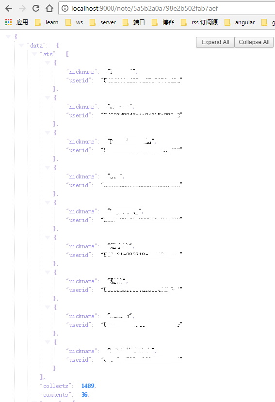

# interface

> 用node.js写的接口

# 使用

```
git clone https://github.com/gabirellaq/interface.git
npm install
npm start

//浏览器地址栏
//获取列信息
http://localhost:9000/list

//获取单条数据详情
http://localhost:9000/note/5a5b2a0a798e2b502fab7aef
```

## 技术点

* express
* node.js
* axios

## 效果图
